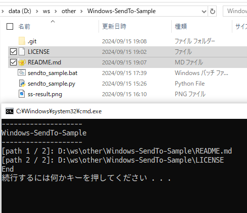

# Windows-SendTo-Sample


## 機能／概要
* Windowsの「右クリック &gt; 送る」のサンプル。右クリックで送られたファイルパスを、Pythonスクリプトで列挙する。


## 構成
* sendto_sample.bat
    * バッチファイル。右クリックで送られたファイルパスを、Pythonスクリプトに渡す。
* sendto_sample.py
    * Pythonスクリプト。渡されたファイルパスを列挙する。


## 設定の手順
sendto_sample.batのショートカットを　SendToフォルダに置く。
 * SendToフォルダの場所
    ```cmd
    %AppData%\Microsoft\Windows\SendTo
    ```


## 実行結果の例  



## 動作環境
* Windows OS 10 64bit
* Python v3.12.5
